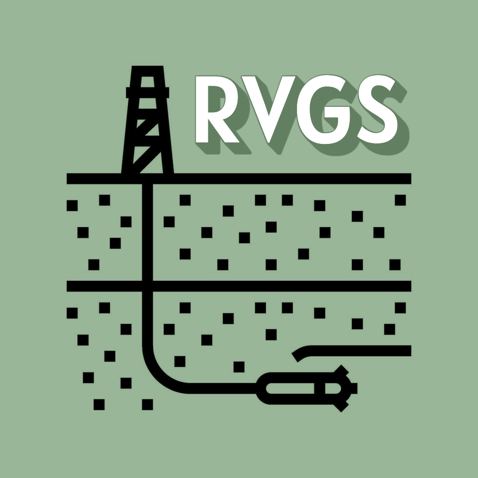

# Well Log Display for the Retlaw Area

### The goal of this project is to:
- develop and maintain Python scripts for horizontal well display. 
- integrate well log data to provide accurate and comprehensive geological insights. 
- collaborate with geologists and geophysicists to understand data requirements and deliver effective solutions. 
- optimize and troubleshoot Python code to improve performance and reliability. 
- document code and processes to ensure maintainability and knowledge sharing within the team. 

